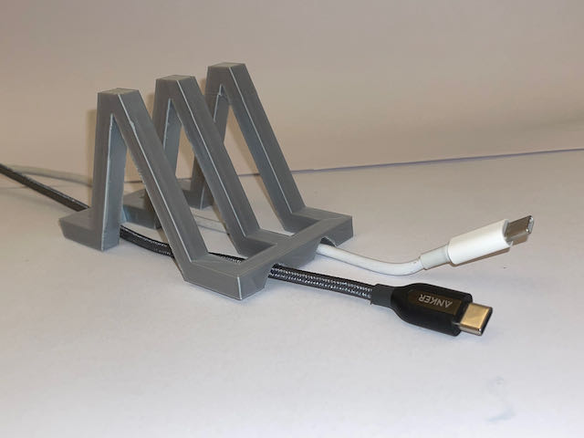
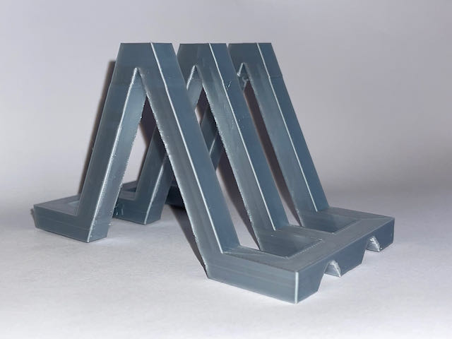
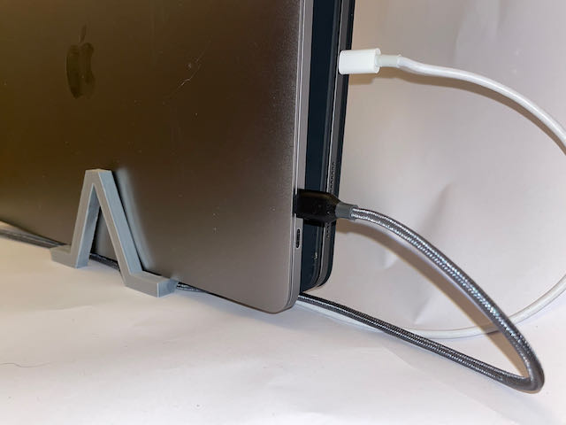

# A customizable 3d-printed (openscad) rack for multiple devices

[Make yours in Configurator](https://www.thingiverse.com/apps/customizer/run?thing_id=4709463)

## Features

* Configure number of devices and all dimensions
* Cutouts for charger cables
* Prints without supports

TODO:

* This design is very blocky. Introduce softer shapes and rounded corners.
* The cable cutouts cut too deep into the base, potentially leaving it weak
* Because 3d printed objects are so light, the rack moves around a lot. How to add some weight?
